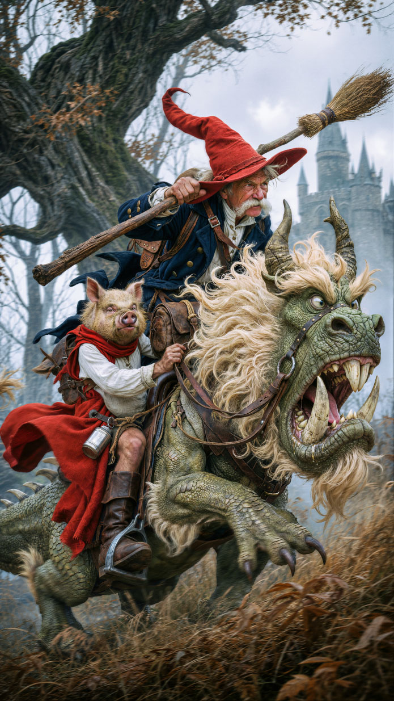
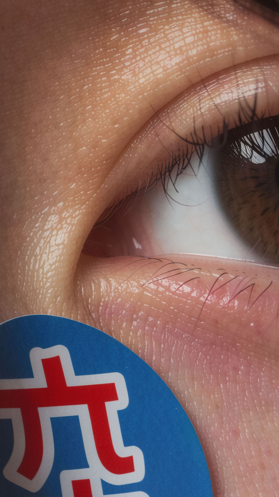
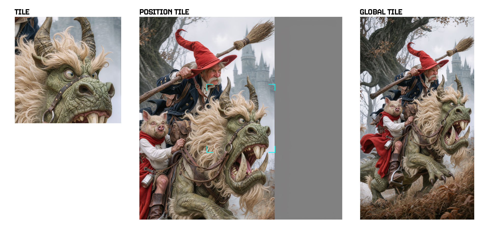

# ComfyUI-42lux-Hildegard-Refiner

Nodos de refinamiento basados en teselas (tiles) para ComfyUI, construidos alrededor del esquema de latentes de referencia Hildegard-Refiner. Diseñado para FLUX.2 Klein.

El paquete es pequeño y modular: tres nodos que se componen en un flujo de refinamiento por teselas limpio. Las matemáticas de teselado han sido tomadas de [ComfyUI_Steudio](https://github.com/Steudio/ComfyUI_Steudio); la construcción de latentes de referencia (tesela / mapa de posición / global) es la contribución real de Hildegard-Refiner.

> **Requiere el LoRA de Hildegard** — estos nodos construyen los latentes de referencia, pero un checkpoint base de FLUX.2 Klein no sabe qué hacer con ellos. El LoRA correspondiente enseña al modelo a consumir los tres espacios de referencia. Descárgalo desde [huggingface.co/42lux/hildegard](https://huggingface.co/42lux/hildegard) y cárgalo como un LoRA normal antes del muestreo.

---

## Ejemplos

| Antes | Después |  |
|---|---|---|
|  |  |  |
|  |  |  |

---

## Qué hace

Un flujo de trabajo estándar de escalado por teselas + refinamiento se ve así:

```
Load Image → Hildegard Plan → Hildegard References Split → [tu sampler] → Hildegard Combine → Save Image
```

1. **Plan** decide las dimensiones escaladas y la cuadrícula de teselas que satisfacen tu tamaño de tesela, solapamiento mínimo y factor de escala mínimo, luego remuestrea la imagen para ajustarla (lanczos por defecto).
2. **References Split** divide la imagen escalada en teselas y, para cada tesela, construye los tres latentes de referencia de Hildegard:
   - **tile_latent** — Recorte codificado por VAE de la propia tesela.
   - **position_latent** — Mapa de "posición" 3×3 codificado por VAE (tesela actual en la celda central, los 8 vecinos alrededor, con marcadores de esquina rodeando el centro).
   - **global_latent** — Miniatura codificada por VAE de toda la imagen escalada (lado largo limitado a `ctrl3_max_size`, por defecto 768px).
3. **Tu sampler** se ejecuta una vez por tesela, con los tres latentes alimentados al modelo como latentes de referencia (típicamente a través del kit de condicionamiento de Klein más controles de peso por referencia). Las cuatro salidas de References Split están alineadas por índice: el elemento `i` corresponde a la misma tesela física en `TILE(S)`, `tile_latent` y `position_latent`.
4. **Combine** une las teselas procesadas nuevamente en una sola imagen con una máscara alfa difuminada. La máscara de cada tesela es sólida en su interior y cero en una franja de ancho `overlap/4` en cada lado que colinda con un vecino; luego la máscara se difumina Gaussianamente (o mediante box-blur en solapamientos estrechos). Resultado: costuras suaves donde se unen las teselas, bordes definidos en los límites del lienzo.

## Separación de frecuencias en la referencia de la tesela

`References Split` puede atenuar la banda de alta frecuencia de la referencia de la tesela antes de que sea codificada por VAE en `tile_latent`. Esto permite intercambiar fidelidad por margen creativo sin tocar los otros espacios de referencia.

Dos controles:

- **`tile_high_freq_reduce`** (0.0 – 1.0, por defecto `0.0`) — cuánto de la banda de alta frecuencia se resta de la referencia de la tesela.
  - `0.0` — se preserva todo el detalle de la fuente (fidelidad estricta, el modelo tiene poco espacio para añadir).
  - `0.5` — equilibrado: se preservan el color y la estructura de la fuente, pero el modelo tiene libertad para sintetizar microdetalles nuevos.
  - `1.0` — versión suave y de bajo contraste que solo preserva formas generales y color.
- **`low_freq_radius`** (1 – 256 px, por defecto `256`) — radio de desenfoque Gaussiano que define el corte entre frecuencias bajas y altas. Mayor = más detalle de la fuente se clasifica como "baja frecuencia" y sobrevive a la reducción; menor = solo las formas más amplias sobreviven y el modelo regenera todo lo demás.

Solo `tile_latent` se ve afectado. La salida de imagen `TILE(S)`, `position_latent` y `global_latent` permanecen intactas, por lo que la estructura y el contexto global se mantienen bloqueados mientras abres la textura para el modelo.

Regla general: aumenta `tile_high_freq_reduce` cuando la fuente ya tenga ruido o esté sobre-enfocada y quieras que el modelo resintetice detalles limpios; mantenlo en `0.0` cuando la fuente esté limpia y quieras un paso fiel.

## Escalado iterativo

Es preferible realizar varias pasadas pequeñas que un solo salto grande. Dos o tres pasadas de ~2× cada una superan consistentemente a una sola pasada de 4–8×: cada paso le da al modelo una referencia más limpia para trabajar, el desvío (drift) se mantiene acotado y las costuras siguen siendo invisibles porque cada tesela solo tiene que inventar una cantidad moderada de detalle nuevo. Un salto grande tiende a alucinar estructuras, exagerar el ruido y amplificar cualquier error por tesela en algo que la siguiente pasada no pueda recuperar.

Una receta práctica: la pasada 1 limpia y aproximadamente duplica, la pasada 2 enfoca y duplica de nuevo, y una pasada 3 opcional solo si necesitas una resolución final extrema. Ajusta `tile_high_freq_reduce` por pasada: las pasadas tempranas pueden usar `0.0` para fidelidad, las pasadas posteriores pueden subirlo ligeramente si el detalle de la fuente comienza a parecer estancado en relación con la nueva resolución.

## `tile_weight` — semejanza vs. creatividad

En el flujo de trabajo de ejemplo, `tile_weight` controla con qué fuerza la referencia `tile_latent` atrae al sampler hacia la tesela original. Es el análogo directo del deslizador de **semejanza / creatividad** en servicios como Magnific:

- **`tile_weight` más alto** → más semejanza. El resultado se adhiere estrictamente a la estructura, color y detalle de la fuente. Más seguro, menos desvío, menos detalle añadido.
- **`tile_weight` más bajo** → más creatividad. El modelo se apoya en el prompt y en sus propios conocimientos previos, inventando detalles nuevos. Resultados más audaces, mayor riesgo de desvío estructural o contenido que la fuente nunca tuvo.

Combínalo con `tile_high_freq_reduce`: `tile_weight` bajo + `tile_high_freq_reduce` alto es la configuración más permisiva (el modelo es libre de reinventar los microdetalles), `tile_weight` alto + reducción de `0.0` es la más fiel (bloqueo a la fuente).

## Ejemplo de teselado

Así es como una imagen fuente se divide en una cuadrícula de teselas (regiones de solapamiento sombreadas). El mismo sistema de coordenadas es utilizado tanto por `References Split` como por `Combine`, por lo que cada tesela vuelve exactamente al lugar de donde provino.



---

## Prompting

El LoRA de Hildegard está entrenado con una frase activadora (`RFNTILE.`) más un prompt estructurado que describe lo que hay en la tesela. Hay tres plantillas de referencia en [`llm_prompt_templates/`](llm_prompt_templates/), ajustadas a diferentes regímenes de recuento de teselas:

| Plantilla | Cuándo | Estilo |
|---|---|---|
| [`full_build_upscale_prompt.md`](llm_prompt_templates/full_build_upscale_prompt.md) | Fuente ≲ 2K–3K, pocas teselas | Prompt basado en bloques por elemento con materiales nombrados y restricciones |
| [`texture_upscale_prompt.md`](llm_prompt_templates/texture_upscale_prompt.md) | Pasada de muchas teselas, regiones de material reconocibles por tesela | Estudio de texturas en un solo párrafo |
| [`subject_less_upscale_prompt.md`](llm_prompt_templates/subject_less_upscale_prompt.md) | Muy alta resolución, sujetos de repetición densa, grandes regiones vacías | Solo familias de materiales genéricas, sin sujetos nombrados |

La regla general:

- **Fuente más pequeña / menos teselas → prompt más ambicioso.** Cada tesela contiene la mayor parte del sujeto, por lo que nombrar los materiales, los elementos frágiles y la iluminación le da al modelo anclajes que realmente puede utilizar.
- **Resultado más grande / más teselas → prompt más conservador.** Las teselas se convierten en recortes de superficie o regiones sin contexto; los sujetos nombrados comienzan a alucinar en teselas que no los contienen. Reduce el prompt a familias de materiales o ve directamente a un enfoque sin sujetos.

Si una pasada se encuentra entre dos niveles, elige el **menos específico**. Un estudio de texturas en una pasada de pocas teselas deja detalles sin aprovechar; un "full build" en una pasada de muchas teselas introduce un desvío que no se puede deshacer. Las introducciones de las plantillas documentan la decisión con más profundidad; vale la pena leerlas una vez antes de componer tu primer prompt para una imagen nueva.

### Prompt Base: 

`RFNTILE. refine and add detail to this upscaled tile. Restore the image quality and resolve it to a sharp, high-resolution result. Remove compression artifacts, banding, and noise, and clarify soft or blurred areas into crisp, clean edges and definition. Enrich existing textures and surfaces with fine, intricate, physically accurate detail, matching the existing grain, focus, and material properties of each surface. Keep in-focus areas crisp and sharp, keep softly blurred areas soft, and leave flat or evenly-toned areas clean and smooth. Recover detail only where detail is already present, and add no new objects, elements, or content — refine only what is already in the tile. Preserve the original lighting, colour, contrast, and composition exactly as shown. Produce a clean, photorealistic result faithful to the source.`

---

## Atribución

Las matemáticas de la cuadrícula de teselas (el solucionador de cuadrícula consciente del solapamiento de `Plan`) y el cosido de máscara difuminada (`Combine`) están adaptados de [ComfyUI_Steudio](https://github.com/Steudio/ComfyUI_Steudio) por Steudio, bajo licencia GPL-3.0. La geometría de construcción de control (recorte por tesela, mapa de posición 3×3 con marcadores de esquina, miniatura global) y la reescritura del esquema de nodos V3 son nuevos en este paquete, motivados por el esquema de entrenamiento del LoRA Hildegard-Refiner.

El "Wizard Rider" fue creado mediante prompt por [Fred Fraiche](https://x.com/FredFraiche) y se utiliza con su permiso. <3

Si encuentras útil el teselado de "Divide y Vencerás" por sí solo, dale una estrella al paquete original de Steudio.
